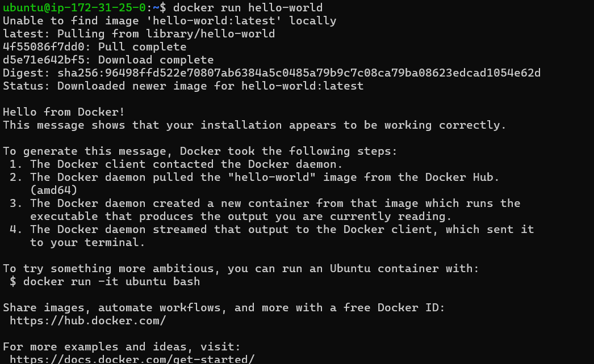
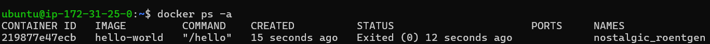
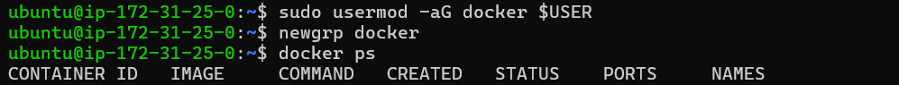
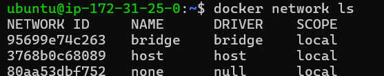
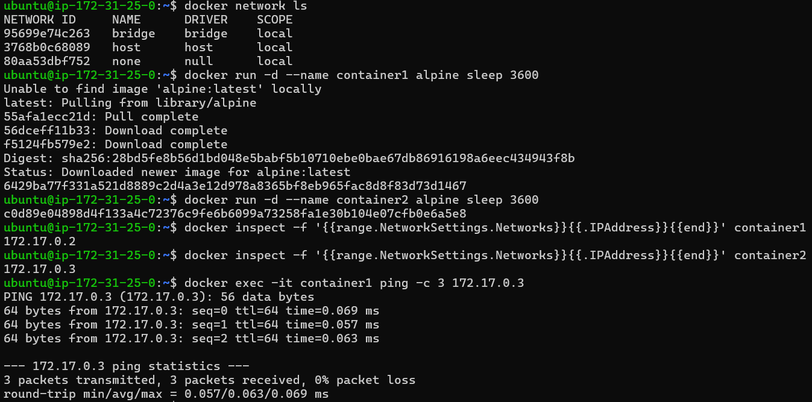
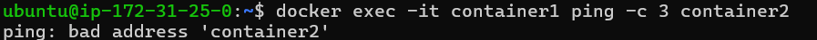
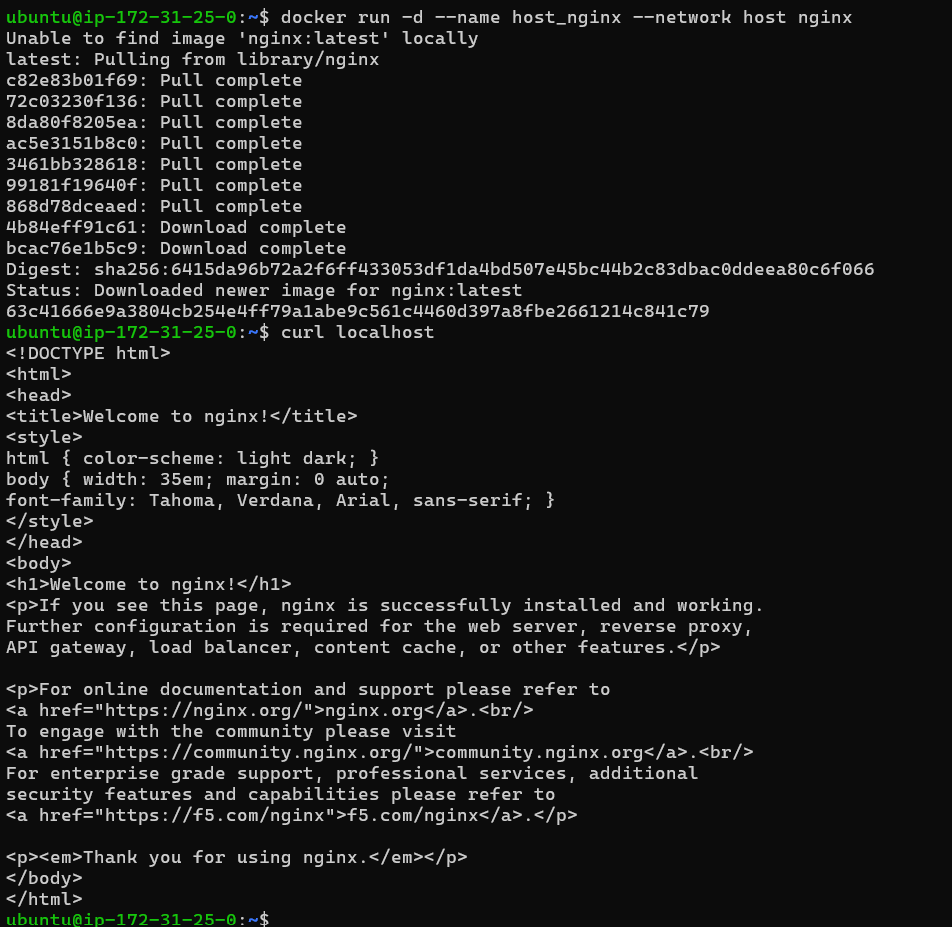
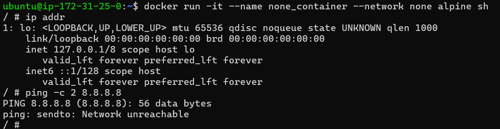
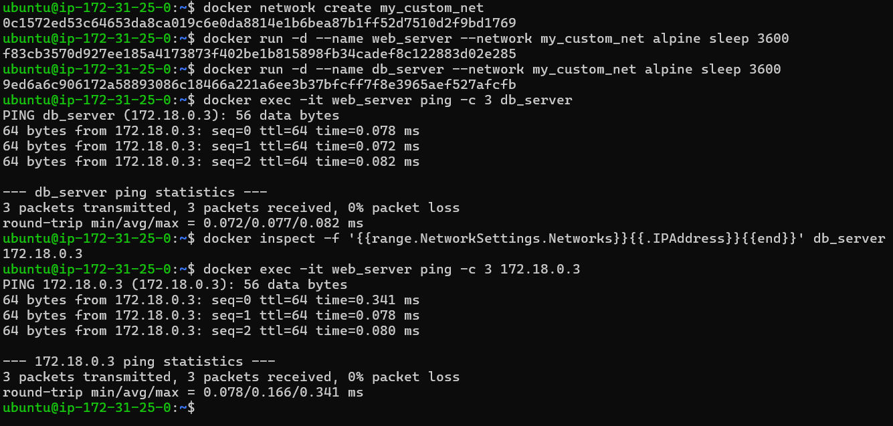
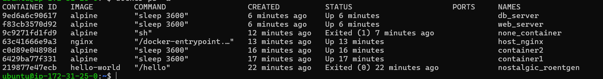

# Docker Setup & Networking Lab on AWS EC2

## 📑 Table of Contents
- [📖 Overview](#-overview)
- [⚙️ Setup Steps](#-setup-steps)
- [🛠️ Configuration Steps](#-configuration-steps)
  - [Docker Permissions (Non-Root)](#docker-permissions-non-root)
  - [Hello-World Image](#hello-world-image)
  - [Bridge Network (Default)](#bridge-network-default)
  - [Host Network](#host-network)
  - [None Network](#none-network)
  - [Custom Bridge Network](#custom-bridge-network)
- [📜 Export Command History](#-export-command-history)
- [📸 Screenshots](#-screenshots)
- [Commands Used](#commands)
- [Network Types](#network-types)

---

## 📖 Overview
This repository documents the complete process of installing Docker on an AWS EC2 instance, configuring non‑root user permissions, and practically demonstrating various Docker network types including **Bridge, Host, None, and Custom Bridge networks**.  
It also covers exporting terminal command history for documentation purposes.

---

## ⚙️ Setup Steps
```bash
# Update package index
sudo apt-get update -y

# Install prerequisite packages
sudo apt-get install ca-certificates curl gnupg lsb-release -y

# Add Docker’s official GPG key
sudo install -m 0755 -d /etc/apt/keyrings
sudo curl -fsSL https://download.docker.com/linux/ubuntu/gpg -o /etc/apt/keyrings/docker.asc
sudo chmod a+r /etc/apt/keyrings/docker.asc

sudo tee /etc/apt/sources.list.d/docker.sources <<EOF
Types: deb
URIs: https://download.docker.com/linux/ubuntu
Suites: $(. /etc/os-release && echo "${UBUNTU_CODENAME:-$VERSION_CODENAME}")
Components: stable
Architectures: $(dpkg --print-architecture)
Signed-By: /etc/apt/keyrings/docker.asc
EOF

# Install Docker Engine
sudo apt-get update -y
sudo apt install docker-ce docker-ce-cli containerd.io docker-buildx-plugin docker-compose-plugin
sudo systemctl status docker
```

---

## 🛠️ Configuration Steps

### Docker Permissions (Non-Root)
```bash
# Add current user to the docker group
sudo usermod -aG docker $USER

# Apply the new group membership immediately
newgrp docker

# Verify Docker runs without sudo
docker ps
```

---

### Hello-World Image
```bash
# Pull and run the hello-world container
docker run hello-world

# Verify the container executed successfully (Status should be 'Exited (0)')
docker ps -a
```

---

### Bridge Network (Default)
```bash
# Run two Alpine containers
docker run -d --name container1 alpine sleep 3600
docker run -d --name container2 alpine sleep 3600

# Check IP addresses
docker inspect -f '{{range.NetworkSettings.Networks}}{{.IPAddress}}{{end}}' container1
docker inspect -f '{{range.NetworkSettings.Networks}}{{.IPAddress}}{{end}}' container2

# Test connectivity by IP
docker exec -it container1 ping -c 3 <IP_of_container2>

# Test DNS resolution by name (FAILS on default bridge)
docker exec -it container1 ping -c 3 container2
```

---

### Host Network
```bash
# Run an Nginx web server using the host network
docker run -d --name host_nginx --network host nginx

# Verify Nginx is serving traffic on the EC2 instance's localhost directly
curl localhost
```

---

### None Network
```bash
# Run an Alpine container with no network
docker run -it --name none_container --network none alpine sh

# Inside the container, check available network interfaces
ip addr

# Try to ping an external address (Will fail)
ping -c 2 8.8.8.8
```

---

### Custom Bridge Network
```bash
# Create a custom bridge network
docker network create my_custom_net

# Run two new Alpine containers attached to this custom network
docker run -d --name web_server --network my_custom_net alpine sleep 3600
docker run -d --name db_server --network my_custom_net alpine sleep 3600

# Test DNS resolution by pinging the container by NAME (Succeeds)
docker exec -it web_server ping -c 3 db_server

#Test connectivity by IP (Will Pass)
docker inspect -f '{{range.NetworkSettings.Networks}}{{.IPAddress}}	{{end}}' db_server
docker exec -it web_server ping -c 3 <IP_of_db_server>

```

---

## 📜 Export Command History
```bash
# Export history to a text file
history > command_history.txt

# (Optional) View the text file to verify
cat command_history.txt
```

---

## 📸 Screenshots
### 1. Docker Hello World


### 2. Docker Running Container (After Installation)


### 3. Docker Give User Permission


### 4. Docker Default Networks


### 5. Docker Default Bridge Network (IP Pass)


### 6. Docker Default Bridge Network (DNS Fail)


### 7. Docker Host Network


### 8. Docker None Network


### 9. Docker Custom Bridge Network


### 10. Docker Running Containers


---

## Commands Used
```bash
sudo apt-get update -y
sudo apt-get install ca-certificates curl gnupg lsb-release -y
sudo install -m 0755 -d /etc/apt/keyrings
sudo curl -fsSL https://download.docker.com/linux/ubuntu/gpg -o /etc/apt/keyrings/docker.asc
sudo chmod a+r /etc/apt/keyrings/docker.asc
sudo tee /etc/apt/sources.list.d/docker.sources <<EOF
Types: deb
URIs: https://download.docker.com/linux/ubuntu
Suites: $(. /etc/os-release && echo "${UBUNTU_CODENAME:-$VERSION_CODENAME}")
Components: stable
Architectures: $(dpkg --print-architecture)
Signed-By: /etc/apt/keyrings/docker.asc
EOF
sudo apt-get update -y
sudo apt install docker-ce docker-ce-cli containerd.io docker-buildx-plugin docker-compose-plugin
sudo systemctl status docker

docker ps
docker run hello-world
docker ps -a
clear
docker network ls
docker run -d --name container1 alpine sleep 3600
docker run -d --name container2 alpine sleep 3600
docker inspect -f '{{range.NetworkSettings.Networks}}{{.IPAddress}}{{end}}' container1
docker inspect -f '{{range.NetworkSettings.Networks}}{{.IPAddress}}{{end}}' container2
docker exec -it container1 ping -c 3 172.17.0.3
docker exec -it container1 ping -c 3 container2
clear
docker run -d --name host_nginx --network host nginx
curl localhost
clear
docker run -it --name none_container --network none alpine sh
docker network create my_custom_net
docker run -d --name web_server --network my_custom_net alpine sleep 3600
docker run -d --name db_server --network my_custom_net alpine sleep 3600
docker exec -it web_server ping -c 3 db_server
docker inspect -f '{{range.NetworkSettings.Networks}}{{.IPAddress}}	{{end}}' db_server
docker exec -it web_server ping -c 3 172.18.0.3
history > command_history.txt
cat command_history.txt

```
---

## Network Types
Docker user different network drivers to control how containers communicate. 
There are 3 default networks in docker. These can be seen after installing docker and running, docker network ls.
They are:
1. Bridge Network
2. Host Network
3. None Network.
There is another Network widely used in docker,
4. Custom Bridge Network

By going through each of them we can get the clear picture of how the networks work in Docker.

--------------------( 1 ) Bridge Network---------------------------<br>
This is the default network for containers. It creates an internal private network on the host. Containers on this network can communicate with each other via IP addresses, but cannot resolve each other by container name. They access the outside world via NAT(Network Address Translation)

--------------------( 2 ) Host Network-----------------------------<br>
This removes network isolation between the container and the Docker host. The container uses the host's networking directly. Port mapping is not required because the container shares the host's IP addresses.

--------------------( 3 ) None Network-----------------------------<br>
The none network driver completely disables networking for the container. The container only has a loopback interface (lo), meaning it cannot connect to the outside world or other containers. This is highly secure and used for offline batch processing.

--------------------( 4 ) Custom Bridge Network--------------------<br>
This is the recommended approach for container communication. Unlike the default bridge, custom bridge network provide automatic DNS resolution. Containers can ping each other by their container names. making application stacks (like a web server talking to a database) highly reliable.

---
